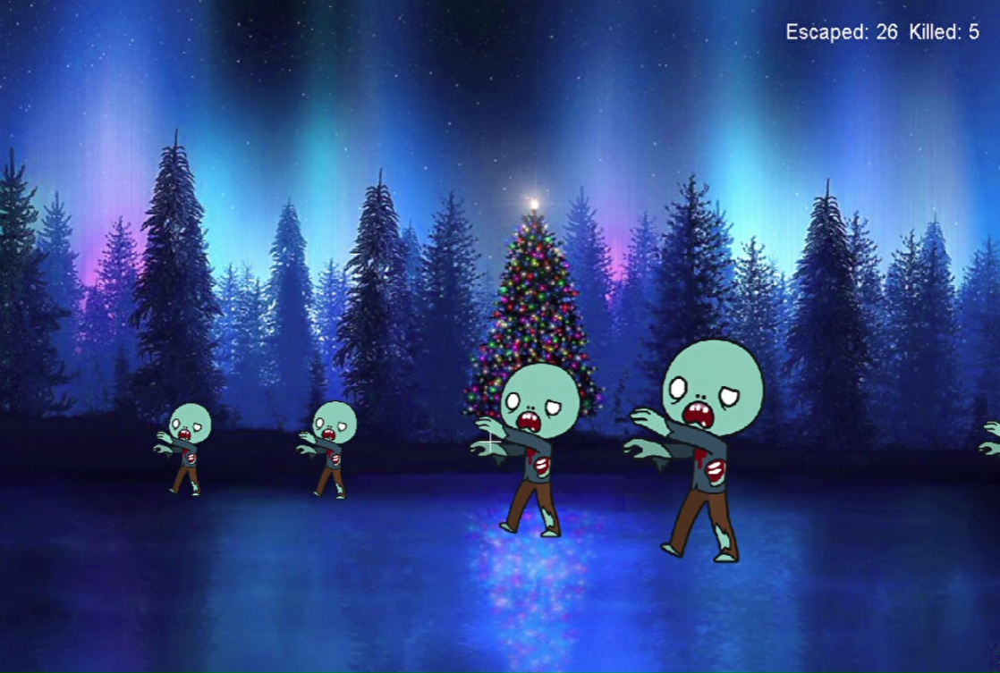

#### Screenshot from one of the assignments - zombie shooter game using Swing.

Zombies walk from right to left, at different distances. If they get all the way to the left before you shoot them, they are counted as escapees.
